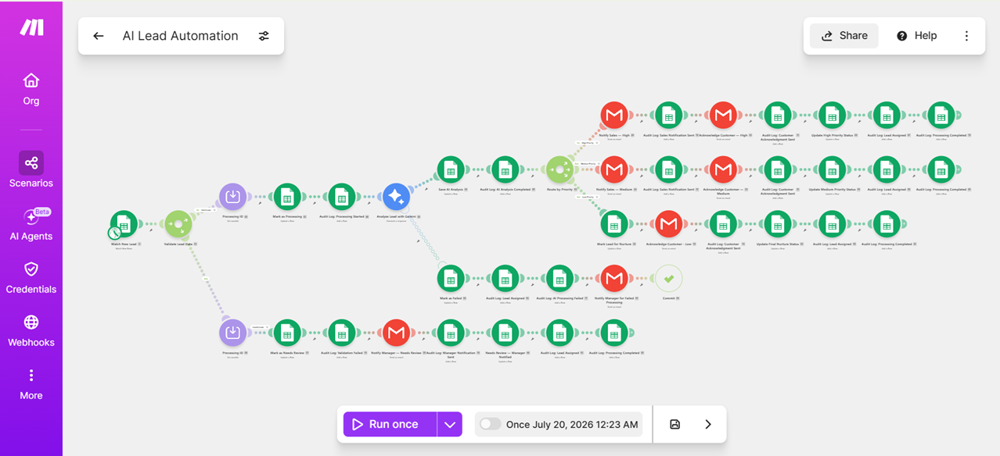
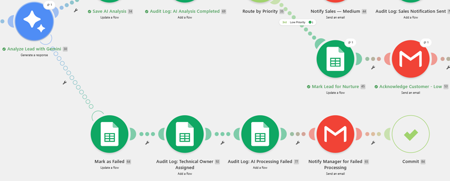
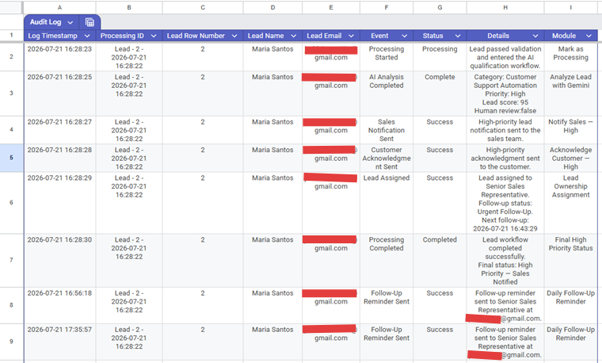
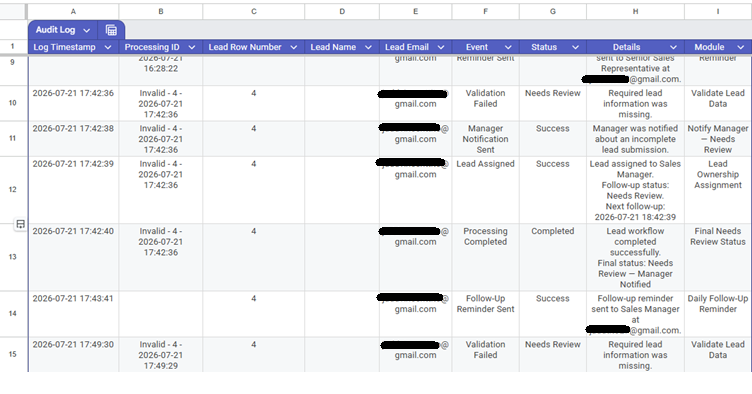
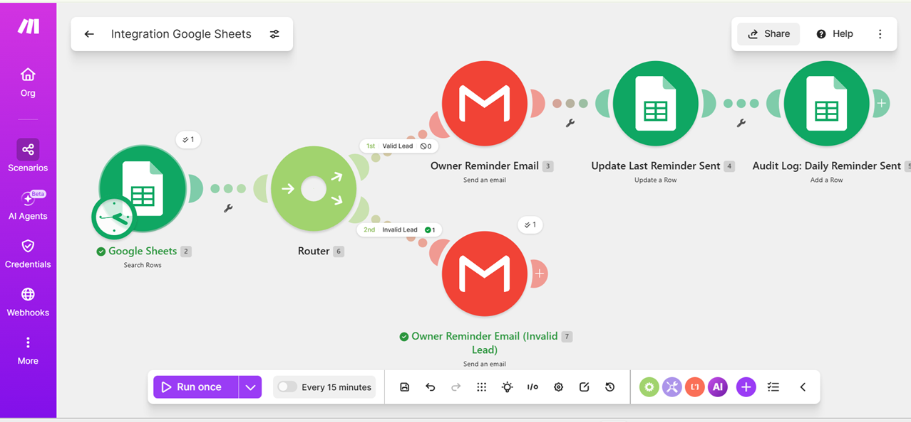
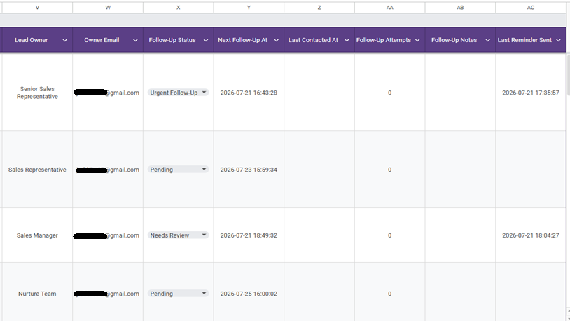
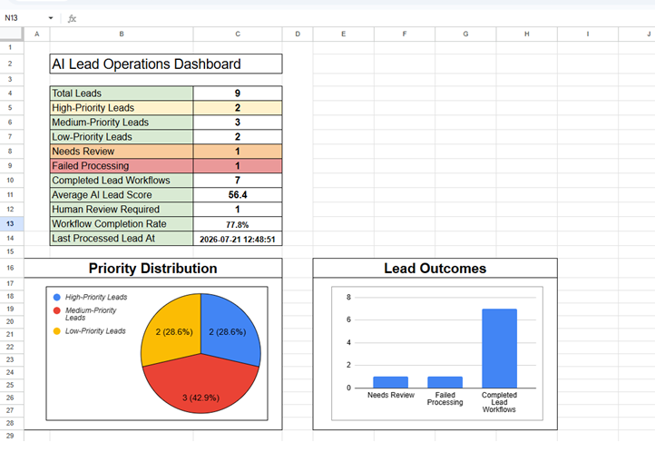

# AI-Powered Lead Qualification and Routing System

> **An AI-assisted customer operations workflow that captures, validates, analyzes, prioritizes, assigns, and tracks incoming leads.**

Built with **Make.com**, **Google Gemini**, **Google Forms**, **Google Sheets**, and **Gmail**.

---

## 📌 Project Overview

This project automates the lead-management process for service-based businesses.

The system:

- Receives inquiries through **Google Forms**
- Validates submitted information
- Analyzes valid leads using **Google Gemini**
- Assigns lead priority and ownership
- Sends internal and customer notifications
- Schedules follow-ups
- Records audit events
- Updates a live operations dashboard

> **Project type:** Portfolio prototype using sample data

---

## 💼 Business Problem

Businesses may lose potential customers when inquiries are:

- Reviewed too slowly
- Handled inconsistently
- Assigned to the wrong person
- Left without follow-up
- Mixed with incomplete submissions
- Not escalated when complaints or sensitive concerns are involved

Manual lead review can also consume valuable time and make it difficult to identify urgent or high-value opportunities.

---

## ✅ Solution

The automation performs the following process:

1. Captures a customer inquiry through Google Forms.
2. Stores the submission in Google Sheets.
3. Validates the required name and email fields.
4. Sends incomplete submissions to a manual-review route.
5. Analyzes valid leads using Google Gemini.
6. Produces structured lead data.
7. Assigns buying intent, score, priority, and recommended action.
8. Routes high-, medium-, and low-priority leads.
9. Sends internal sales notifications.
10. Sends safe customer acknowledgment emails.
11. Assigns a lead owner and follow-up deadline.
12. Records important events in an audit log.
13. Handles Gemini failures through a dedicated error route.
14. Sends reminders for overdue follow-ups.
15. Displays operational metrics in a dashboard.

---

## 🔄 Workflow Architecture



### **Valid Lead Route**

```text
Google Form
→ Google Sheets
→ Validate lead
→ Generate Processing ID
→ Mark as Processing
→ Gemini analysis
→ Save AI results
→ Route by priority
→ Notify team
→ Acknowledge customer
→ Assign owner
→ Schedule follow-up
→ Update final status
→ Record audit events
```

### **Invalid Lead Route**

```text
Invalid submission
→ Generate Invalid Processing ID
→ Mark as Needs Review
→ Notify manager
→ Assign manager ownership
→ Schedule manual review
→ Record audit events
```

### **Failure Route**

```text
Gemini failure
→ Mark lead as Failed
→ Assign Automation Administrator
→ Save error details
→ Record failure audit event
→ Send internal alert
→ Commit
```

---

## ⭐ Key Features

- **Required-field validation**
- **Duplicate-processing protection**
- **AI lead classification**
- **Customer-need extraction**
- **Lead summaries**
- **Buying-intent classification**
- **Lead scoring from 0 to 100**
- **High-, medium-, and low-priority routing**
- **Human-review escalation**
- **Professional HTML email notifications**
- **Customer-safe acknowledgment messages**
- **Lead ownership assignment**
- **Follow-up deadlines**
- **Overdue follow-up reminders**
- **Unique Processing IDs**
- **Error handling**
- **Audit logging**
- **Live operations dashboard**

---

## 🤖 AI Output

Google Gemini returns structured lead information such as:

```json
{
  "category": "Customer Support Automation",
  "customer_need": "Faster handling of booking inquiries",
  "summary": "Travel company seeking an automated response and routing system.",
  "buying_intent": "High",
  "lead_score": 90,
  "priority": "High",
  "recommended_action": "Schedule a discovery call.",
  "requires_human_review": false
}
```

### **AI Output Fields**

| Field | Purpose |
|---|---|
| **Category** | Identifies the inquiry type |
| **Customer Need** | Extracts the main problem or desired outcome |
| **Summary** | Gives the sales team a short overview |
| **Buying Intent** | Classifies purchase readiness |
| **Lead Score** | Assigns a score from 0 to 100 |
| **Priority** | Routes the lead as High, Medium, or Low |
| **Recommended Action** | Suggests an internal next step |
| **Human Review** | Escalates sensitive or unclear requests |

---

## 👤 Priority and Ownership Rules

| Lead Type | Assigned Owner | Follow-Up Target |
|---|---|---|
| **High Priority** | Senior Sales Representative | 15 minutes |
| **Medium Priority** | Sales Representative | 1 day |
| **Low Priority** | Nurture Team | 3 days |
| **Invalid Submission** | Sales Manager | 1 hour |
| **Processing Failure** | Automation Administrator | Technical review |

---

## 🛡️ Reliability and Error Handling

The workflow includes:

- **Status-based duplicate protection**
- A `Processing` state before AI execution
- **Unique Processing IDs**
- Final completion timestamps
- Separate success and failure audit events
- Stored Gemini error messages
- Internal failure notifications
- A **Commit** directive to stop failed processing
- Separate reminder templates for valid and invalid leads



---

## 🧾 Audit Logging

Every important workflow event is saved as a separate row in an **Audit Log** worksheet.

### **Recorded Events**

- Processing Started
- AI Analysis Completed
- Sales Notification Sent
- Customer Acknowledgment Sent
- Lead Assigned
- Validation Failed
- Manager Notification Sent
- Follow-Up Reminder Sent
- AI Processing Failed
- Processing Completed





---

## ⏰ Follow-Up Reminder Workflow

A separate reminder scenario checks for overdue follow-ups and sends an internal email to the assigned owner.

### **Reminder Rules**

- The follow-up date must be due or overdue.
- An owner email must exist.
- `Closed Won` leads are excluded.
- `Closed Lost` leads are excluded.
- Invalid leads receive a separate reminder template.
- The reminder timestamp is saved in Google Sheets.
- A reminder audit event is created.



---

## 📋 CRM-Style Follow-Up Tracking

The lead sheet tracks:

- **Lead Owner**
- **Owner Email**
- **Follow-Up Status**
- **Next Follow-Up At**
- **Last Contacted At**
- **Follow-Up Attempts**
- **Follow-Up Notes**
- **Last Reminder Sent**

### **Supported Follow-Up Statuses**

```text
Urgent Follow-Up
Pending
Needs Review
Technical Review
Contacted
Replied
Qualified
Closed Won
Closed Lost
Uncontactable
```



---

## 📊 Operations Dashboard

The live dashboard reports:

- **Total leads**
- **High-priority leads**
- **Medium-priority leads**
- **Low-priority leads**
- **Needs Review cases**
- **Failed processing**
- **Completed lead workflows**
- **Average AI lead score**
- **Human-review count**
- **Workflow completion rate**
- **Last processed timestamp**



---

## 🧪 Test Cases

| Test Case | Expected Outcome | Result |
|---|---|---|
| High-intent automation inquiry | High-priority route | **Passed** |
| Lead comparing possible solutions | Medium-priority route | **Passed** |
| General inquiry without a timeline | Low-priority nurture route | **Passed** |
| Complaint or sensitive request | Human-review escalation | **Passed** |
| Missing required information | Needs Review route | **Passed** |
| Gemini quota or model failure | Failure-handling route | **Passed** |
| Overdue follow-up | Owner reminder sent | **Passed** |
| Invalid lead reminder | Manual-review email sent | **Passed** |

---

## 🧰 Tools Used

| Tool | Purpose |
|---|---|
| **Make.com** | Workflow orchestration and routing |
| **Google Forms** | Customer inquiry collection |
| **Google Sheets** | Lightweight CRM, audit log, and dashboard |
| **Google Gemini API** | AI classification and structured analysis |
| **Gmail** | Internal and customer email communication |
| **HTML/CSS** | Professional email formatting |

---

## 📄 Technical Documentation

The complete technical documentation and standard operating procedure is available below:

**[View the Technical Documentation and SOP](docs/ai-lead-automation-technical-sop-v1.pdf)**

The document includes:

- Workflow architecture
- Status definitions
- Ownership rules
- Audit standards
- Troubleshooting instructions
- Manual sales procedures
- Security rules
- System limitations

---

## 🔐 Security and Safety

- **API keys are not stored in this repository.**
- Screenshots use sample or redacted information.
- Internal AI scores are not exposed to customers.
- Sensitive requests are escalated for human review.
- AI is not allowed to approve refunds, cancellations, legal decisions, or financial outcomes.
- The audit log avoids unnecessary sensitive customer data.

---

## ⚠️ Limitations

- Google Sheets is used as a lightweight CRM rather than a dedicated CRM platform.
- AI analysis depends on Gemini API availability and usage limits.
- Sales representatives update follow-up statuses manually.
- The system was tested using sample data.
- Email delivery and automation performance depend on third-party services.
- This is a portfolio prototype and has not been deployed with live customer data.

---

## 🚀 Future Improvements

- HubSpot or GoHighLevel integration
- Calendar booking automation
- SMS notifications
- Automatic lead assignment by territory or workload
- Duplicate-lead detection using email and company data
- Automated follow-up sequences
- AI confidence scoring
- Processing-time analytics
- Role-based access controls
- Migration from Google Sheets to a database or CRM

---

## 🧠 Skills Demonstrated

- **Workflow automation**
- **Business-process analysis**
- **Conditional routing**
- **AI API integration**
- **Structured JSON outputs**
- **Data validation**
- **CRM workflow design**
- **Error handling**
- **Audit logging**
- **Operational reporting**
- **Technical documentation**
- **Testing and debugging**

---

## 📍 Project Status

> **Prototype completed**

This project was built as part of my transition into **AI automation**, **customer operations**, and **workflow development**.

---

## 👨‍💻 Author

**Judd Vincent Tito**

Aspiring **AI Automation Specialist** focused on customer operations, CRM workflows, and service-business automation.
